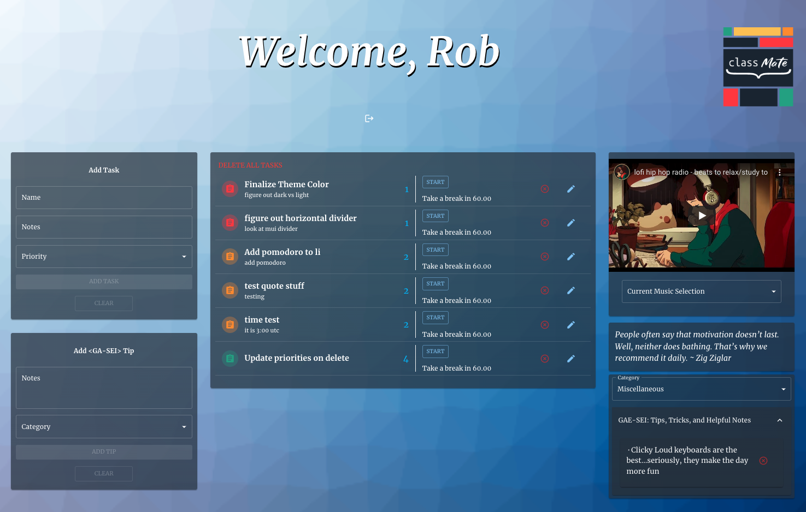

## Classmate

Welcome to 𝒞𝓁𝒶𝓈𝓈𝓂𝒶𝓉𝑒 , your place to add,update,delete,and edit a to-do list of task to help you manage your time in this co-hort. You can play background music, add notes and tips for other classmates to see,  view your list of task (arranged by priority from 1-5) and use a built in timer all without leaving the page! As a bonus, also built a custom favicon and logo and background. Happy Hacking!

[Click here to get to the Deployed Link](https://62e15ac73cdbe5364d5fae23--classmate-hackathon.netlify.app/)

## Getting Started  

Users are able to:
- create, edit, and delete tasks
- play background music on page 
- play a timer to keep track of time management
- view notes and tips from other students

## Github

[Click here to get to the Back-End Github](https://github.com/egger0a6/classmate-api)

### Website Preview

## Technologies Used:
  
  
  
  
  
  
  
  

## API Used:

## Next Steps
- [ ] Broader music selection
- [ ] Users can check off task after completion
- [ ] Users can see elapsed time using the timer
- [ ] Mobile friendly
## Contributors 
<!--  -->
- [Rob Reynolds](https://github.com/razorhollow)
<!--  -->
- [Zach Eggert](https://github.com/egger0a6)
- [Savienne M](https://github.com/Savienne)

##Credits

